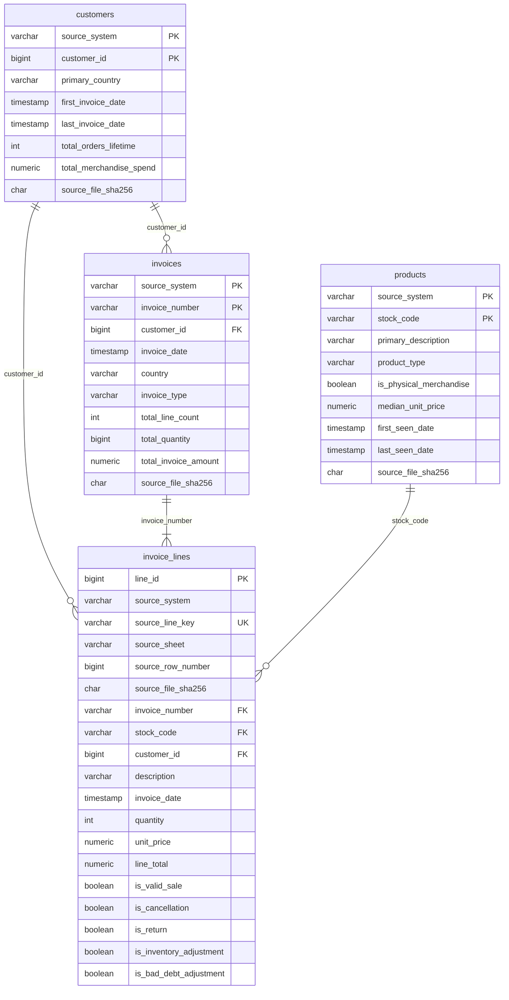

# Nexora Commerce AI ERD

## Grain and relationships

## Cardinality

- `customers` to `invoices`: **1:N**. One identified customer can have many
  invoice headers; an invoice has zero or one customer because guest lines
  retain a nullable `customer_id`.
- `customers` to `invoice_lines`: **1:N**. One identified customer can have
  many lines; a line may have no customer.
- `invoices` to `invoice_lines`: **1:N**. Each invoice header has one or more
  source transaction lines.
- `products` to `invoice_lines`: **1:N**. One source-scoped stock code can
  occur on many lines; each line references one product.

The source namespace is part of every entity identity. This prevents an
invoice or stock code from UCI being accidentally joined to an identically
named key from MMRec or Amazon.
